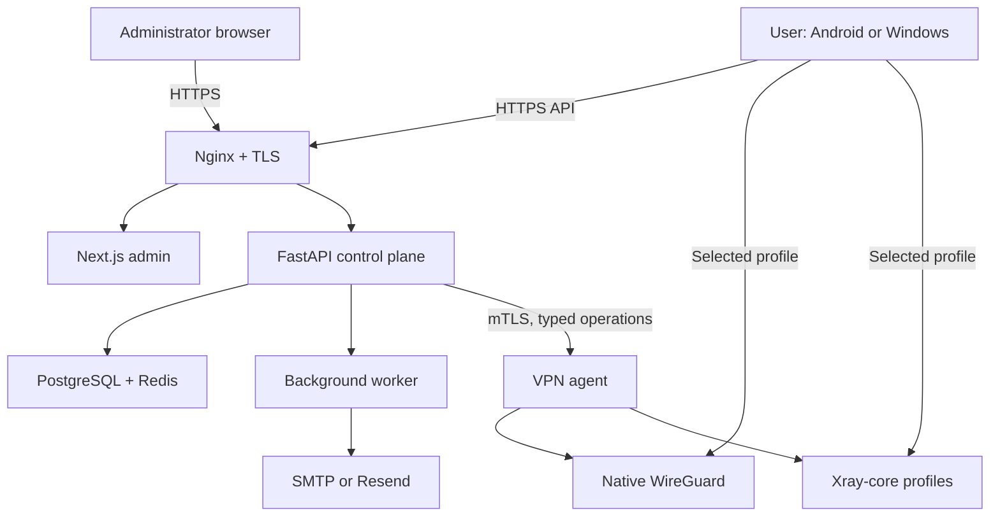

# Phase 1 architecture

## Goals

Phase 1 must support the complete approval-to-connection lifecycle with native
WireGuard on one Ubuntu VPS. The final product also supports user-selectable
Xray-core profiles. Identity, permissions, server capabilities, credentials, and
provisioning state must therefore be protocol-neutral from the first migration.

## System context



Nginx, the web applications, API, worker, PostgreSQL, and Redis can run in Docker
Compose. The VPN agent should run as a hardened systemd service on the host because
it needs tightly constrained network-administration and process-control
capabilities. The public API containers remain unprivileged and do not mount the
Docker socket, host root, WireGuard keys, Xray credentials, or TLS private keys.

## Components and responsibilities

| Component      | Responsibility                                                           | Explicitly forbidden                             |
| -------------- | ------------------------------------------------------------------------ | ------------------------------------------------ |
| Nginx          | TLS termination, request-size limit, headers, routing                    | Authentication decisions                         |
| Next.js admin  | Authenticated administration UI and server-side API facade               | Direct database or agent access                  |
| FastAPI        | Business rules, authorization, transactions, audit, agent orchestration  | Root, arbitrary shell, VPN private keys          |
| Worker         | Durable email and maintenance jobs                                       | Becoming the source of truth                     |
| PostgreSQL     | Identity, requests, permissions, assignments, provisioning intent, audit | Storing client private keys or plaintext tokens  |
| Redis          | Rate limits, admin sessions, job queue, short-lived coordination         | Permanent business records                       |
| VPN agent      | Typed WireGuard/Xray provision, revoke, health, validate, reconcile      | User auth, arbitrary config or command execution |
| Flutter client | Auth, profile selection, secure credentials, TUN/tunnel control          | Logging or publicly exporting client credentials |

## Trust boundaries

1. **Internet to edge:** all input is hostile; TLS, size limits, validation, rate
   limits, and generic errors apply.
2. **Edge to applications:** internal routing is not authorization; each service
   validates identity and role.
3. **API to data stores:** dedicated least-privilege database and Redis accounts;
   no public ports.
4. **API to VPN agent:** mutual TLS, certificate rotation, replay-resistant request
   identifiers, strict schema validation, and an operation allowlist.
5. **Agent to protocol runtimes:** only validated WireGuard and Xray driver
   operations; hardened service units, minimal capabilities, fixed binaries, and
   root-owned configuration/key paths.
6. **Client device:** WireGuard private keys, Xray credentials, generated profiles,
   and OS tunnel permissions remain outside the public web trust boundary.

## Account approval and activation

```mermaid
sequenceDiagram
    participant U as Requester
    participant A as API
    participant D as PostgreSQL
    participant W as Worker
    participant M as Administrator
    U->>A: Submit account request
    A->>D: Store PENDING + audit + email outbox
    A-->>U: Neutral accepted response
    W->>M: Review link (no approval action)
    M->>A: Authenticated approval + MFA
    A->>D: Lock request; create user once; hash activation token
    W->>U: Single-use activation link
    U->>A: Set own password
    A->>D: Consume token atomically; activate user
```

Approval uses a row lock and a unique relationship between `account_requests` and
`users`. Repeating the same approved operation returns the existing result rather
than creating another user. Email intent is stored in the same database transaction
and delivered asynchronously, preventing an email outage from corrupting approval.

## Authentication model

### User applications

- Argon2id password hashes with parameters calibrated in deployment testing.
- 15-minute Ed25519-signed access JWTs containing minimal identity and session IDs.
- Opaque cryptographically random refresh tokens, stored as keyed hashes.
- Refresh rotation in one transaction; reuse revokes the entire token family.
- A server-side session per registered device; logout and administrator actions can
  revoke one device or all sessions.
- Generic login and password-reset responses to reduce account enumeration.

### Administrators

- Separate `admin_users` identity store and authorization roles.
- Password plus TOTP MFA; recovery codes are single use and hashed.
- Opaque server-side session in Redis, sent in Secure, HttpOnly, SameSite=Strict
  cookies.
- Per-request CSRF token for state-changing operations.
- Step-up MFA for destructive user, server, and credential operations.
- Lockout and rate limits by account and network prefix, with audit events.

## Protocol capability model

Xray-core is an engine, not one protocol. Nebula uses a data-driven capability
registry rather than allowing arbitrary combinations. Each `protocol_profile`
defines a reviewed tuple of:

- engine: native WireGuard or Xray-core
- user-facing protocol: WireGuard, VLESS, VMess, Trojan, Shadowsocks, or Hysteria2
- Xray transport where applicable: RAW, XHTTP, mKCP, gRPC, WebSocket, HTTPUpgrade,
  or Hysteria
- transport security where applicable: TLS or REALITY
- compatible client platforms, required ports, DNS behavior, and feature flags

The client protocol picker returns only profiles enabled on the selected server and
allowed for the authenticated user. It never constructs a free-form combination.
HTTP, SOCKS, TUN, dokodemo-door, DNS, Freedom, Blackhole, and Loopback remain
internal Xray building blocks unless a later reviewed use case promotes one.

The full classification and delivery order are in
[`protocol-roadmap.md`](protocol-roadmap.md).

## Provisioning model

All drivers implement typed operations such as `provision_device`, `revoke_device`,
`enable_device`, `get_client_profile`, `health`, and `reconcile`. The API never sends
shell text, binary paths, or raw Xray JSON. Idempotency and desired/actual state are
shared, while protocol-specific validation stays in the driver.

Provisioning is an explicit state machine:

`REQUESTED -> APPLYING -> ACTIVE -> REVOKING -> REVOKED`, with `FAILED` available
at each mutation boundary. PostgreSQL records desired state; the agent reports
actual state. A reconciliation job repairs safe drift and raises an alert for
ambiguous drift.

### Native WireGuard

Each device owns one WireGuard peer. The client generates a key pair through native
platform integration and retains the private key in Android Keystore-backed storage
or Windows DPAPI/Credential Manager. It sends only the public key.

The agent renders a validated candidate, checks it with WireGuard tooling, applies
the delta with `wg syncconf`, and records an operation ID. Server private keys remain
root-readable files on the VPN host. The API stores only public server information.

### Xray-core

Each Xray-enabled device/profile receives a unique credential; credentials are not
shared between users or devices. Credential material is envelope-encrypted when the
control plane must retain it, delivered only to the authenticated device, stored in
platform-secure storage, and excluded from logs and public subscription URLs.

The Xray driver accepts only a `protocol_profile_id` and typed credential intent. It
renders configuration from trusted templates, validates the complete candidate with
the pinned Xray binary, atomically applies it, verifies health, and rolls back to the
last-known-good configuration on failure. TLS and REALITY private keys remain
root-readable host files. Real user email addresses are never placed in Xray's user
label field; opaque internal identifiers are used instead.

Android feeds its OS-provided VPN file descriptor into the Xray TUN boundary;
Windows uses Xray TUN/Wintun through a narrowly privileged service. Selecting an
Xray profile must route system traffic through the OS VPN/TUN layer, not merely set
an application proxy.

## Data model boundaries

The first migrations will include the required tables:

- Identity: `users`, `admin_users`, `devices`, `user_sessions`, `refresh_tokens`
- Approval: `account_requests`, `account_request_events`, `user_activations`
- Recovery: `password_reset_tokens`
- Authorization: `protocols`, `protocol_profiles`, `user_protocol_permissions`
- Topology: `vpn_servers`, `server_protocol_capabilities`,
  `user_server_assignments`
- Provisioning: `device_protocol_credentials`, `wireguard_peers`, `xray_clients`,
  agent operation/reconciliation records
- Operations: `audit_logs`, `email_deliveries`, `server_health`, `settings`

UUID primary keys are used at API boundaries. Normalized email and username columns
have unique indexes. Token tables contain hashes, expiry, consumption, revocation,
and token-family metadata, never plaintext token values.

## Proposed monorepo structure

```text
apps/
  admin/
    app/
    components/
    lib/
    tests/
  mobile/
    lib/core/
    lib/features/
    test/
    android/
    windows/
services/
  api/
    src/nebula_api/
    alembic/
    tests/
  vpn-agent/
    src/nebula_agent/
    tests/
infrastructure/
  compose/
  nginx/
  systemd/
  backup/
  monitoring/
docs/
  adr/
  runbooks/
.github/workflows/
```

## Deployment evolution

For one VPS, a server row identifies the local agent and its enabled WireGuard/Xray
profiles. For additional servers, the API assigns users/devices to other server
rows and calls each agent through the same versioned mTLS contract. New reviewed
Xray combinations are capability data plus a driver/template version, not a control
plane redesign.
