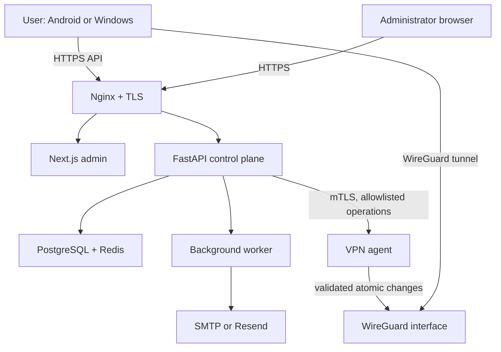

# Phase 1 architecture

## Goals

Phase 1 must support the complete approval-to-connection lifecycle on one Ubuntu
VPS while allowing VPN servers to be added later without redesigning identities,
assignments, or provisioning state.

## System context



Nginx, the web applications, API, worker, PostgreSQL, and Redis can run in Docker
Compose. The VPN agent should run as a hardened systemd service on the host because
it needs tightly constrained network-administration capabilities. The public API
containers remain unprivileged and do not mount the Docker socket or host root.

## Components and responsibilities

| Component      | Responsibility                                                           | Explicitly forbidden                            |
| -------------- | ------------------------------------------------------------------------ | ----------------------------------------------- |
| Nginx          | TLS termination, request-size limit, headers, routing                    | Authentication decisions                        |
| Next.js admin  | Authenticated administration UI and server-side API facade               | Direct database or agent access                 |
| FastAPI        | Business rules, authorization, transactions, audit, agent orchestration  | Root, arbitrary shell, WireGuard private keys   |
| Worker         | Durable email and maintenance jobs                                       | Becoming the source of truth                    |
| PostgreSQL     | Identity, requests, permissions, assignments, provisioning intent, audit | Storing client private keys or plaintext tokens |
| Redis          | Rate limits, admin sessions, job queue, short-lived coordination         | Permanent business records                      |
| VPN agent      | Narrow peer create/update/revoke, health, reconcile                      | User auth, arbitrary command execution          |
| Flutter client | Auth, device registration, local key generation, tunnel control          | Uploading or logging its private key            |

## Trust boundaries

1. **Internet to edge:** all input is hostile; TLS, size limits, validation, rate
   limits, and generic errors apply.
2. **Edge to applications:** internal routing is not authorization; each service
   validates identity and role.
3. **API to data stores:** dedicated least-privilege database and Redis accounts;
   no public ports.
4. **API to VPN agent:** mutual TLS, certificate rotation, replay-resistant request
   identifiers, strict schema validation, and an operation allowlist.
5. **Agent to host:** only validated WireGuard operations; hardened service unit,
   minimal capabilities, root-owned configuration and key paths.
6. **Client device:** device private keys and OS tunnel permissions remain outside
   the server trust boundary.

## Account approval and activation

```mermaid
sequenceDiagram
    participant U as Requester
    participant A as API
    participant D as PostgreSQL
    participant W as Worker
    participant M as Administrator
    U->>A: Submit account request
    A->>D: Store PENDING + audit + email outbox
    A-->>U: Neutral accepted response
    W->>M: Review link (no approval action)
    M->>A: Authenticated approval + MFA
    A->>D: Lock request; create user once; hash activation token
    W->>U: Single-use activation link
    U->>A: Set own password
    A->>D: Consume token atomically; activate user
```

Approval uses a row lock and a unique relationship between `account_requests` and
`users`. Repeating the same approved operation returns the existing result rather
than creating another user. Email intent is stored in the same database transaction
and delivered asynchronously, preventing an email outage from corrupting approval.

## Authentication model

### User applications

- Argon2id password hashes with parameters calibrated in deployment testing.
- 15-minute Ed25519-signed access JWTs containing minimal identity and session IDs.
- Opaque cryptographically random refresh tokens, stored as keyed hashes.
- Refresh rotation in one transaction; reuse revokes the entire token family.
- A server-side session per registered device; logout and administrator actions can
  revoke one device or all sessions.
- Generic login and password-reset responses to reduce account enumeration.

### Administrators

- Separate `admin_users` identity store and authorization roles.
- Password plus TOTP MFA; recovery codes are single use and hashed.
- Opaque server-side session in Redis, sent in Secure, HttpOnly, SameSite=Strict
  cookies.
- Per-request CSRF token for state-changing operations.
- Step-up MFA for destructive user, server, and credential operations.
- Lockout and rate limits by account and network prefix, with audit events.

## VPN provisioning model

Each device owns one WireGuard peer. The client generates a key pair through native
platform integration and retains the private key in Android Keystore-backed storage
or Windows DPAPI/Credential Manager. It sends only the public key.

Provisioning is an explicit state machine:

`REQUESTED -> APPLYING -> ACTIVE -> REVOKING -> REVOKED`, with `FAILED` available
at each mutation boundary. A unique constraint protects `(server_id, public_key)`
and allocated tunnel IPs. PostgreSQL records desired state; the agent reports actual
state. A reconciliation job repairs safe drift and raises an alert for ambiguous
drift.

The agent renders a validated candidate, checks it with WireGuard tooling, applies
the delta with `wg syncconf`, and records an operation ID. Server private keys remain
root-readable files on the VPN host. The API stores only public server information.

## Data model boundaries

The first migrations will include the required tables:

- Identity: `users`, `admin_users`, `devices`, `user_sessions`, `refresh_tokens`
- Approval: `account_requests`, `account_request_events`, `user_activations`
- Recovery: `password_reset_tokens`
- Authorization: `protocols`, `user_protocol_permissions`
- Topology: `vpn_servers`, `user_server_assignments`
- Provisioning: `wireguard_peers`, agent operation/reconciliation records
- Operations: `audit_logs`, `email_deliveries`, `server_health`, `settings`

UUID primary keys are used at API boundaries. Normalized email and username columns
have unique indexes. Token tables contain hashes, expiry, consumption, revocation,
and token-family metadata, never plaintext token values.

## Proposed monorepo structure

```text
apps/
  admin/
    app/
    components/
    lib/
    tests/
  mobile/
    lib/core/
    lib/features/
    test/
    android/
    windows/
services/
  api/
    src/nebula_api/
    alembic/
    tests/
  vpn-agent/
    src/nebula_agent/
    tests/
infrastructure/
  compose/
  nginx/
  systemd/
  backup/
  monitoring/
docs/
  adr/
  runbooks/
.github/workflows/
```

## Deployment evolution

For one VPS, a server row still identifies the local WireGuard endpoint and agent.
For additional servers, the API assigns users/devices to other server rows and
calls each agent through the same versioned mTLS contract. The public control plane
does not need a protocol-specific database redesign.
